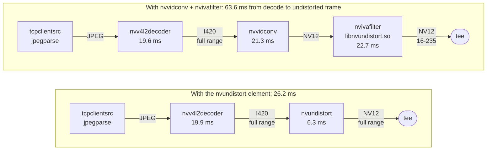
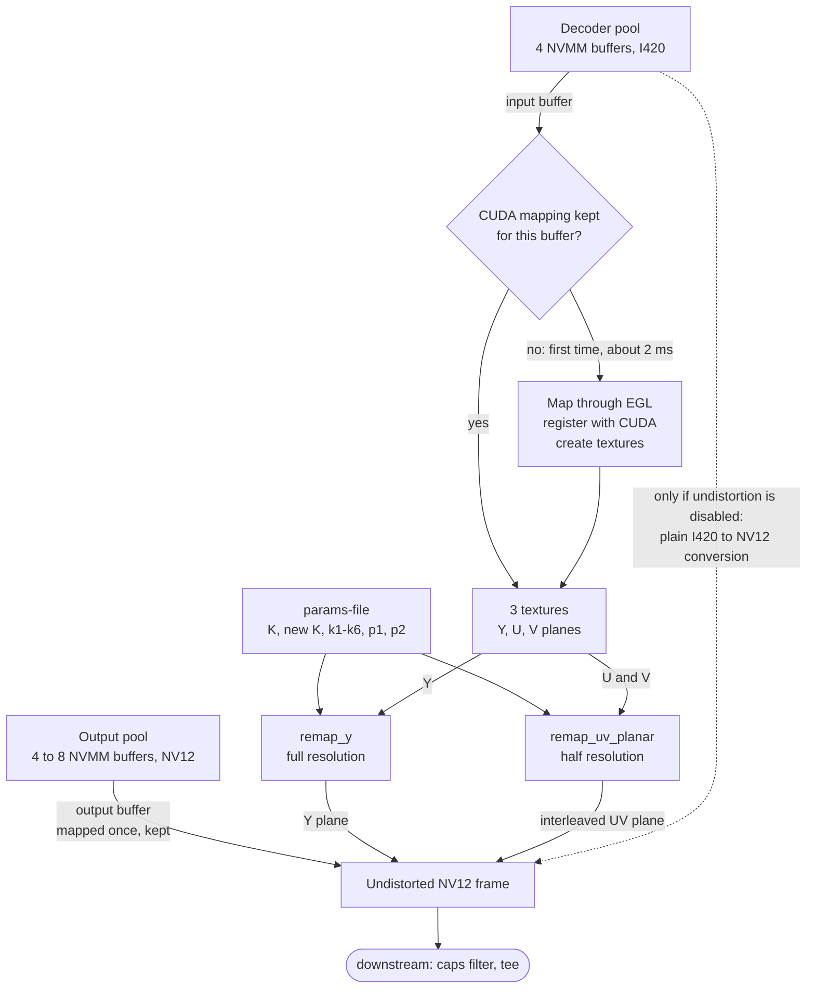
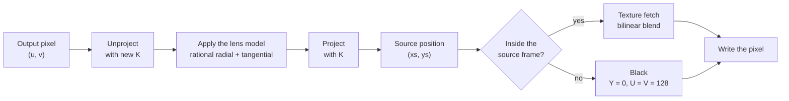

# nvundistort: dataflow

How a camera frame travels from the decoder to the undistorted frame, with and
without the `nvundistort` element, and what happens inside the element.

Times are the median each element holds a frame (GStreamer latency tracer) on
the Jetson Orin Nano at 4608×2592 / 14 fps, default clocks, a saved frame
looped. See [ELEMENT_PLAN.md](ELEMENT_PLAN.md) for how they were taken.

## The pipeline, before and after

`nvv4l2decoder mjpeg=1` outputs I420. Converting that to NV12 costs about 22 ms
in whichever element does it. The element does the conversion inside the
remap, so that step disappears.

After the tee nothing changes: the detection branch (`nvstreammux` 960×544 →
PeopleNet → NVDCF) and the gaze branch (RGBA in system memory → appsink) both
receive the undistorted NV12 frame, so they share one geometry.

## Inside the element, per frame

All frame data stays in NVMM (GPU-visible) memory. The element never copies
the input: the kernels read the decoder's buffer through textures and write
into a different buffer from the element's own pool.

- **Kept mappings.** Mapping a buffer into CUDA and unmapping it again costs
  about 3 ms, so each buffer is mapped once and the mapping is kept, keyed by
  the buffer's dmabuf fd. The decoder cycles through four buffers. Mappings
  are dropped on a caps change and when the element stops.
- **The dashed path** is the fallback. If undistortion cannot run (no usable
  `params-file`, another frame size, a CUDA error), the element warns once and
  only converts, so frames keep flowing, distorted.

## Inside a kernel, per output pixel

Both kernels do the same thing, `remap_y` on luma and `remap_uv_planar` on
the half-resolution chroma. There is no lookup table: the source position is
computed for every pixel, with the same model as OpenCV's
`initUndistortRectifyMap`.

